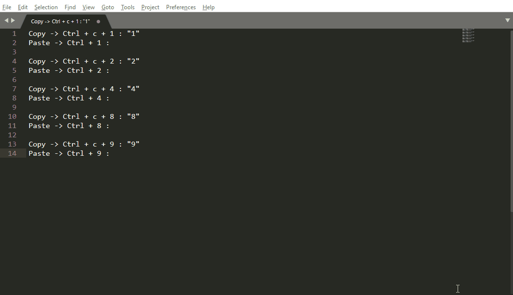
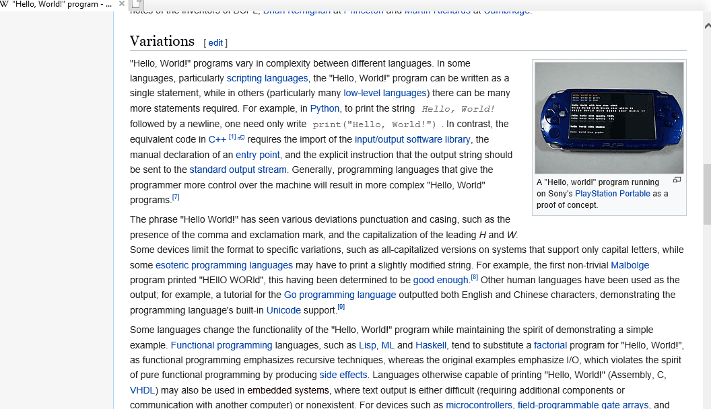

He is [**Larry Tesler**](https://en.wikipedia.org/wiki/Larry_Tesler). If you don't already know, he invented the copy-paste functionality!

# Multiple Copy & Paste Buffers

A Python implementation of multiple copy and paste buffers on Windows.   
Allows you to have copy multiple items at once and paste them as per need.

Index
-----
<!--ts-->
   * [What is it?](#what-is-it)
   * [Inspiration](#inspiration)
   * [Features](#features)
   * [Installation](#installation)
      * [Usage Example](#usage-example)
      * [Demo](#demo)
   * [Current Limitations](#current-limitations)
   * [Planned Features](#planned-features)
<!--te-->

## What is it?
An easy to use version of a multiple copy & paste buffers implementation.      
Hence, this attempt is being made. 
Copy multiple. Paste multiple!!

Completely developed in Python (for faster prototyping).

## Inspiration

This project is the brainchild of my friend Mayank Joshi. This was his proposed college project that never made it to the development phase for reasons unknown.
Also, think of the scenarios in which this utility might be very helpful (eg. copy multiple lines from different paragraphs from several web pages at once. Will definitely in plagiarizing your next assignment) **Demo attached**.

## Features
1. Allows copying multiple multiline string items at once.
2. Allows upto 9 buffers at once. 
3. Woks with text editors (Tested with MS Word, Sublime Text, Acrobat Reader).
4. Works with Internet browsers (Tested with IE)

## Installation
Intallation is simple
```
$ git clone https://github.com/akashgovind95/MultipleCopyPasteBuffer.git
$ cd MultipleCopyPasteBuffer/
$ pip install -r requirements.txt
```
### Usage Example
1. Either use your preferred IDE (I use pyCharm) or cmd. Your wish :)    
```
$ python main_code.py //main file to run the code
```
2. Let the IDE/cmd window rest in the background    
3. Now, open some text editor (Recommeded Sublime Text 3)     
4. Select some text and press Ctrl + c + 1 to save the text on the first buffer and Ctrl + c + 2 to save text on second buffer and so on.      

**To copy:** Ctrl + C + [1-9]    
**To paste:** Ctrl + [1-9]

**Note:** Instead of Ctrl + v + [1-9] for paste, I used Ctrl + [1-9] due to some technical difficulties. Will work fixing it later. (Next weekend probably) 

### Demo

#### Demo 1 (Working with text editor)


#### Demo 2 (Working with web browser)


### Current Limitations
1. Ctrl + c +3 doesn't work for now. Seems like an intermittent issue. Works on my other machine.
2. Although it copies text, it doesn't copy formatting information like text size, font, font color, bold, underline etc.
3. Doesn't work with Chrome, Ctrl + [1-8] is already being used to switch between tabs.

### Planned Features
1. Extend this utility to copying files and image data (e.g. cropped out part of an image. Could be useful in tools like PS).
2. Copy formatting information.
3. Create an UI to keep a track of items in buffer.
4. Implement for cut (ctrl + x) as well.
5. Provide information about the process for contribute.

